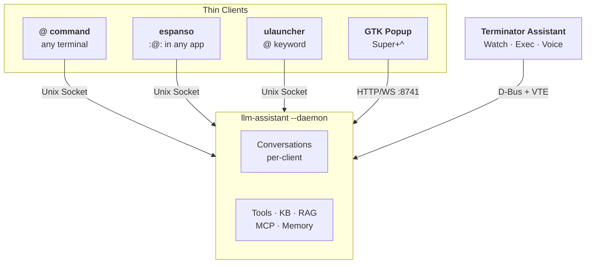

# LLM Tools for Linux

One script installs [Simon Willison's llm CLI](https://github.com/simonw/llm) with 40+ plugins, shell integration, terminal assistants, and desktop AI tools on Debian-based Linux.

<!-- START doctoc generated TOC please keep comment here to allow auto update -->
<!-- DON'T EDIT THIS SECTION, INSTEAD RE-RUN doctoc TO UPDATE -->

- [From CLI to AI Environment](#from-cli-to-ai-environment)
  - [Level 0 — LLM CLI](#level-0--llm-cli)
  - [Level 1 — Enhanced Shell](#level-1--enhanced-shell)
  - [Level 2 — Inline Assistant](#level-2--inline-assistant)
  - [Level 3 — Terminal AI](#level-3--terminal-ai)
  - [Level 4 — Desktop AI](#level-4--desktop-ai)
  - [Level 5 — Agentic Coding](#level-5--agentic-coding)
- [Architecture](#architecture)
- [Installation](#installation)
  - [Requirements](#requirements)
  - [Quick Start](#quick-start)
  - [Installation Levels](#installation-levels)
  - [Provider Configuration](#provider-configuration)
  - [Updating](#updating)
  - [Recommended Prerequisite](#recommended-prerequisite)
- [Quick Reference](#quick-reference)
- [Documentation](#documentation)
  - [Component Documentation](#component-documentation)
  - [Original Tools](#original-tools)
- [Support](#support)
- [Related Projects](#related-projects)
- [Credits](#credits)
- [License](#license)
- [Contributing](#contributing)

<!-- END doctoc generated TOC please keep comment here to allow auto update -->

## From CLI to AI Environment

This project installs six layers of AI capability. Each builds on the previous.

| Level | Name | What You Get |
|:-----:|------|-------------|
| 0 | **LLM CLI** | `llm "query"`, `llm chat`, fragments, templates, RAG, code gen, 40+ plugins |
| 1 | **Enhanced Shell** | Smart wrapper, `wut`, Ctrl+N completion, session recording, context tool |
| 2 | **Inline Assistant** | `@ query` in any terminal, per-terminal conversations, daemon-backed |
| 3 | **Terminal AI** | Terminator pair programming, watch mode, KB, memory, reports, MCP, voice |
| 4 | **Desktop AI** | GTK popup (Super+^), espanso `:@:`, ulauncher, speech-to-text |
| 5 | **Agentic Coding** | Claude Code, Claude Code Router, Codex CLI |

### Level 0 — LLM CLI

```bash
llm "What does this error mean?"              # Ask anything
llm chat                                       # Interactive conversation
llm -f github:user/repo "Analyze this"        # Load context from anywhere
llm code "bash backup script" | tee backup.sh  # Generate code
llm rag add docs /path/to/files               # Build a searchable knowledge base
```

### Level 1 — Enhanced Shell

```bash
wut                          # AI explains your last command's output
# Type: find large pdf files → Press Ctrl+N → AI suggests the command
llm "what was the error?"    # Context tool auto-reads your terminal history
```

### Level 2 — Inline Assistant

```bash
@ explain this error                # AI assistant in any terminal
@ /new                              # Fresh conversation
@ @pdf:report.pdf summarize this    # Attach fragments
```

### Level 3 — Terminal AI

```bash
llm assistant                       # Launch in Terminator
/watch detect security issues       # Proactive monitoring
/kb load pentest-checklist          # Load knowledge base
/report "SQL injection in login"    # Capture pentest finding
/mcp load microsoft-learn           # Enable MCP server
# note about this project           # Save to persistent memory
/voice                              # Voice input
```

### Level 4 — Desktop AI

| Interface | Access | Description |
|-----------|--------|-------------|
| GTK Popup | Super+^ | System-wide AI popup with desktop context |
| espanso | `:@:` trigger | AI text expansion in any application |
| ulauncher | `@` keyword | AI via application launcher |
| transcribe | CLI | Speech-to-text (25 languages) |

### Level 5 — Agentic Coding

```bash
claude                              # Claude Code
routed-claude                       # Claude Code via multi-provider router
```

## Architecture

All assistants talk to one daemon. Switch from terminal to popup mid-conversation and it just works.



## Installation

### Requirements

Debian, Ubuntu, or Kali Linux · Python 3.8+ · Internet access · ~500MB disk space

Rust 1.85+ and Node.js 20+ are installed automatically if needed.

### Quick Start

```bash
sudo git clone https://github.com/c0ffee0wl/llm-linux-setup.git /opt/llm-linux-setup
sudo chown -R $(whoami):$(whoami) /opt/llm-linux-setup
cd /opt/llm-linux-setup
./install-llm-tools.sh
```

You'll be prompted for a provider (Azure OpenAI or Google Gemini) and session log storage location.

### Installation Levels

| Level | Flag | What's Included |
|:-----:|------|----------------|
| 1 | `--minimal` | LLM core + all plugins |
| 2 | `--standard` | + Claude Code, shell integration, session recording |
| 3 | `--full` | + desktop integration, GUI tools, extras **(default)** |

Levels persist between runs. Use `--full` to override a saved lower level.

### Provider Configuration

```bash
./install-llm-tools.sh --azure    # Configure Azure OpenAI (enterprise)
./install-llm-tools.sh --gemini   # Configure Google Gemini (free tier)
```

See [Provider Setup](docs/PROVIDERS.md) for details.

### Updating

```bash
cd /opt/llm-linux-setup
./install-llm-tools.sh            # Self-updates, then updates everything
```

### Recommended Prerequisite

For a fully configured Linux environment, install [linux-setup](https://github.com/c0ffee0wl/linux-setup) first (optional).

## Quick Reference

```bash
# === LLM CLI (Level 0) ===
llm "Your question"                          # Ask (assistant template auto-applied)
llm -c "Follow up"                           # Continue conversation
llm chat                                     # Interactive mode
llm code "python function to..." | tee f.py  # Generate code
llm -f github:user/repo "Analyze"            # Fragment: GitHub repo
llm -f pdf:doc.pdf "Summarize"               # Fragment: PDF
llm -f yt:https://youtube.com/watch?v=ID "Key points"  # Fragment: YouTube
llm -f site:https://example.com "Extract"    # Fragment: web page
llm -t fabric:summarize < article.txt        # Use template
llm rag add docs /path/to/files              # RAG: add documents
llm -T 'rag("docs")' "How does auth work?"  # RAG: query
llm git-commit                               # AI commit message
cat items.txt | llm sort --query "Most relevant"  # Semantic sort
llm "Run uname -a" --td                      # Sandboxed shell (show details)
llm -T Patch "Edit config.yaml" --ta         # File manipulation (approve)
imagemage generate "watercolor fox"          # Image generation (Gemini)

# === Enhanced Shell (Level 1) ===
wut                                          # Explain last command output
wut "how do I fix this?"                     # Specific question
# Type description, press Ctrl+N             # AI command completion
context                                      # Show last command
context 5                                    # Show last 5 commands

# === Inline Assistant (Level 2) ===
@ What does this error mean?                 # Query (any terminal)
@ Tell me more                               # Continue conversation
@ /new                                       # Fresh conversation
@ /status                                    # Session info
@ @pdf:report.pdf summarize                  # Fragment attachment

# === Terminal AI (Level 3) ===
llm assistant                                # Launch in Terminator
/watch detect security issues                # Watch mode
/kb load checklist                           # Knowledge base
/memory                                      # Show persistent memory
# This is important                          # Quick note to memory
/mcp load microsoft-learn                    # MCP server
/report "XSS in search field"               # Pentest finding
/report export                               # Export findings to Word
/voice                                       # Voice input
/speech                                      # TTS output
/screenshot                                  # Capture screen
/web                                         # Open web companion
/squash                                      # Compress context
/rewind -3                                   # Rewind 3 turns
/copy                                        # Copy last response

# === Desktop AI (Level 4) ===
# Super+^ (or Super+`)                      # GTK popup
# Super+Shift+^ (or Super+Shift+`)          # Popup with selection
# :@: in any text field                      # espanso assistant
# :llm: in any text field                    # espanso simple query
# @ in ulauncher (Ctrl+Space)               # Ulauncher assistant
transcribe recording.mp3                     # Speech-to-text

# === Agentic Coding (Level 5) ===
claude                                       # Claude Code
routed-claude                                # Claude Code Router
```

## Documentation

| Document | Contents |
|----------|----------|
| **[Usage Guide](docs/USAGE.md)** | Detailed usage for all levels |
| [Provider Setup](docs/PROVIDERS.md) | Azure, Gemini, models, API keys |
| [Desktop Integration](docs/DESKTOP_INTEGRATION.md) | GTK popup, espanso, ulauncher, speech-to-text |
| [Reference](docs/REFERENCE.md) | Plugins, templates, config files, credits |
| [Troubleshooting](docs/TROUBLESHOOTING.md) | Common issues and fixes |
| [CLAUDE.md](CLAUDE.md) | Developer architecture guide |

### Component Documentation

| Component | Documentation |
|-----------|---------------|
| Session Recording & Context | [`llm-tools-context/CLAUDE.md`](llm-tools-context/CLAUDE.md) |
| Shell Integration | [`integration/CLAUDE.md`](integration/CLAUDE.md) |
| Terminator Assistant | [`llm-assistant/CLAUDE.md`](llm-assistant/CLAUDE.md) |
| Inline Assistant (`@`) | [`llm-inlineassistant/CLAUDE.md`](llm-inlineassistant/CLAUDE.md) |
| GUI Assistant (GTK) | [`llm-guiassistant/CLAUDE.md`](llm-guiassistant/CLAUDE.md) |

### Original Tools

- [LLM Documentation](https://llm.datasette.io/)
- [LLM Plugins Directory](https://llm.datasette.io/en/stable/plugins/directory.html)
- [Claude Code Documentation](https://docs.anthropic.com/en/docs/claude-code/overview)

## Support

- Issues: https://github.com/c0ffee0wl/llm-linux-setup/issues

## Related Projects

- [llm-windows-setup](https://github.com/c0ffee0wl/llm-windows-setup) — Windows version

## Credits

Core: [Simon Willison](https://github.com/simonw) (llm), [Anthropic](https://www.anthropic.com/) (Claude Code), [Astral](https://astral.sh/) (uv), [Daniel Miessler](https://github.com/danielmiessler) (Fabric patterns).

Full credits in [Reference](docs/REFERENCE.md#credits).

## License

This installation script is provided as-is. Individual tools have their own licenses — see [Reference](docs/REFERENCE.md#license).

## Contributing

See [CLAUDE.md](CLAUDE.md) for architecture documentation.
